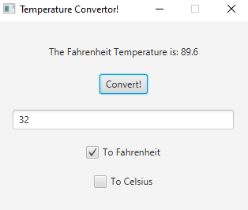
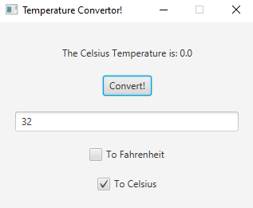
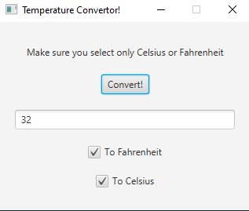
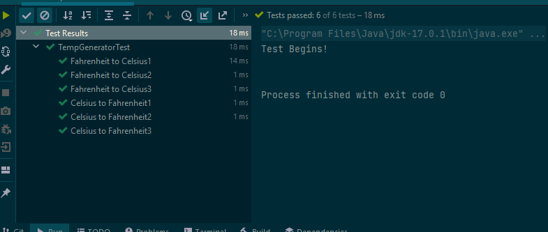

# Temperature Convertor
A simple Temperature Converator with a GUI using javafx

## Usage

Celsius To Fahrendheit<br />
<br />
Fahrendheit To Celsius<br />
<br />
Both Selected<br />
<br />
Setup JUnit tests<br />

## Usage

```java
import com.parkhurst.temperatureconverator.TempGenerator;

// returns 100
TempGenerator.fToC(212)

// returns -21
TempGenerator.cToF(-6)
```

## License
[MIT](https://choosealicense.com/licenses/mit/)
